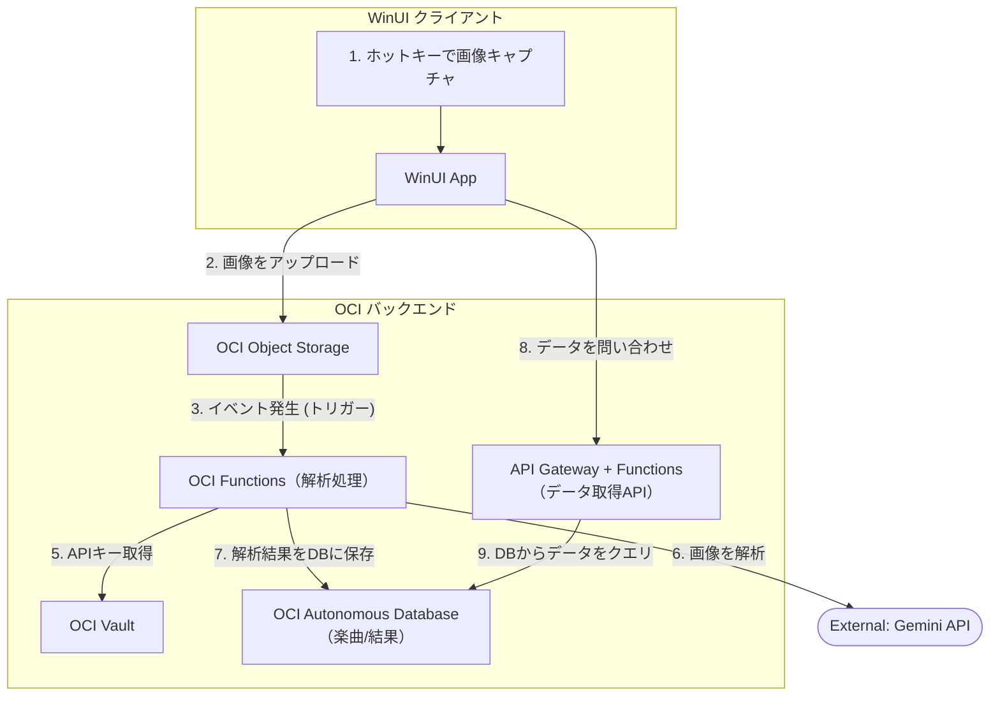
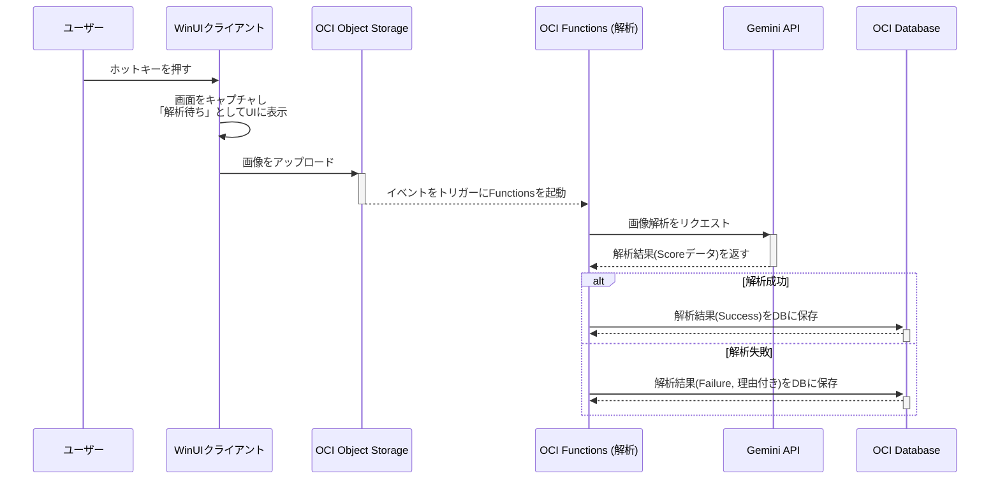
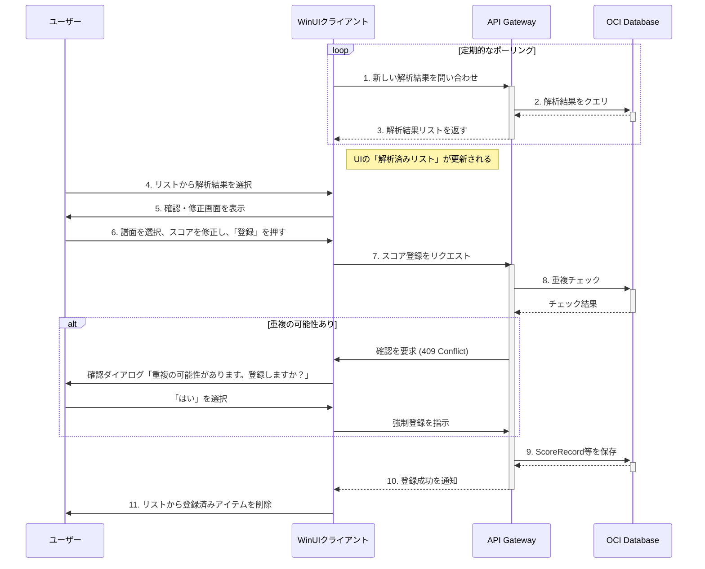
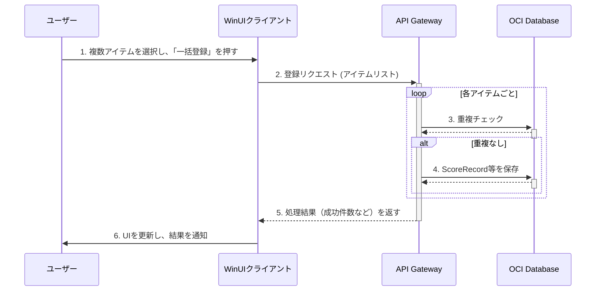
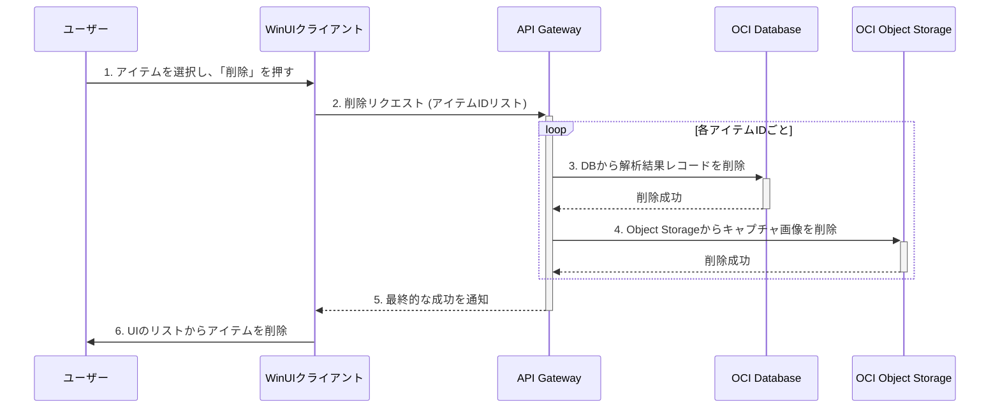
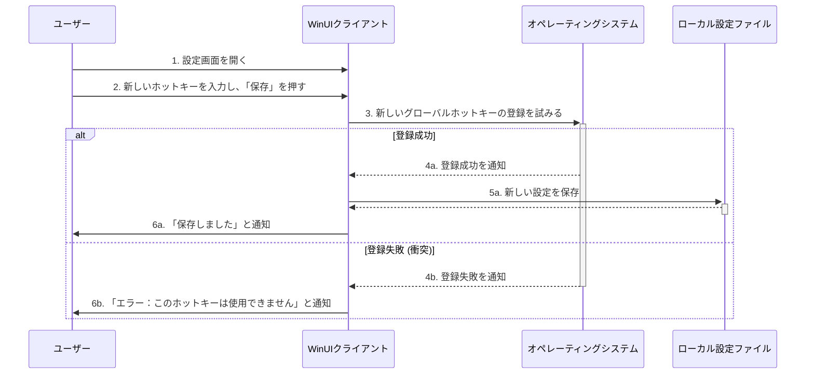
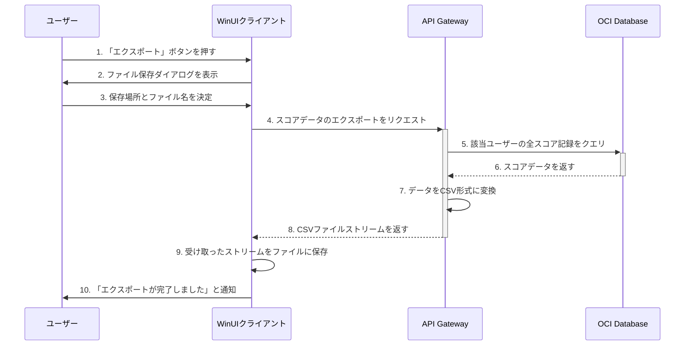
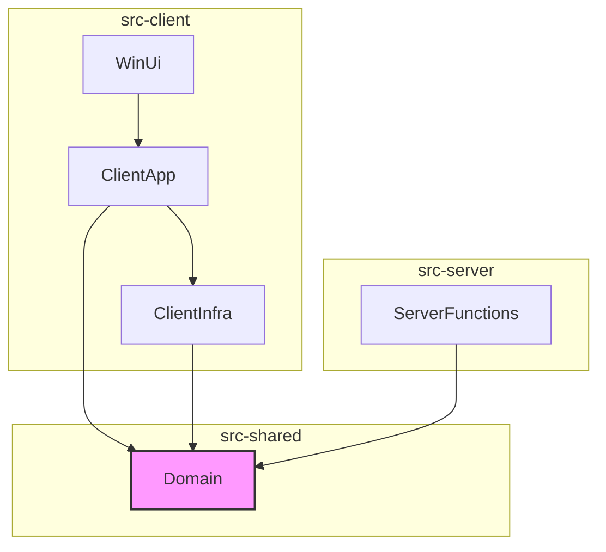

# DDRスコア管理アプリケーション ドメイン駆動設計仕様書

* **ドキュメントバージョン:** 2.0
* **最終更新日:** 2025年10月13日
* **作成者:** Gemini & Project Owner

---

## 1. プロジェクトの全体像とアーキテクチャ

### 1.1. はじめに

#### 1.1.1. 目的

本ドキュメントは、DanceDanceRevolution (DDR) のスコアを管理するデスクトップアプリケーションの開発における、ドメイン駆動設計（DDD）に基づいた設計仕様を定義することを目的とする。

このアプリケーションは、プレイヤーが自身のスコアを記録・追跡し、成長を可視化することを支援する。本ドキュメントは、開発チームが共通の理解を持ち、一貫性のある高品質なソフトウェアを構築するための礎となる。

#### 1.1.2. 設計アプローチ

本プロジェクトでは、拡張性と堅牢性を確保するため、クライアント／サーバー型のアーキテクチャを基盤とし、以下の設計アプローチを組み合わせる。

* **クライアント／サーバーアーキテクチャ:** UIやユーザー操作を担当する**クライアント**（WinUIアプリ）と、データ処理や永続化、外部連携を担当する**サーバー**（OCIバックエンド）を明確に分離する。
* **サーバーレス & イベント駆動:** サーバーサイドの処理は、特定のイベント（画像のアップロードなど）をトリガーとして実行されるサーバーレス関数（OCI Functions）を中心とし、効率的なリソース活用とスケーラビリティを実現する。
* **ドメイン駆動設計 (DDD):** ビジネスの核となるロジックを、クライアントとサーバーの両方から参照可能な共有`Domain`レイヤーにカプセル化する。
* **クリーンアーキテクチャ:** クライアント、サーバーそれぞれの内部で、ビジネスロジックが外部の技術詳細に依存しない構造を維持する。
* **CQRS (コマンド・クエリ責務分離):** データの書き込み（コマンド）と読み込み（クエリ）のパスを物理的に分離する。
* **テスト駆動開発 (TDD):** 実装コードの前にテストコードを記述し、品質を確保する。

#### 1.1.3. 技術スタック概要

* **クライアント:**
    * **UI:** WinUI 3
* **サーバー (Oracle Cloud Infrastructure - OCI):**
    * **API:** OCI API Gateway
    * **コンピューティング:** OCI Functions (サーバーレス)
    * **ストレージ:** OCI Object Storage (キャプチャ画像保存)
    * **データベース:** OCI Autonomous Database (Always Free枠)
    * **セキュリティ:** OCI Vault (APIキーなど機密情報の保管)
* **外部サービス:**
    * **画像認識:** Google Gemini API
* **共通:**
    * **言語/プラットフォーム:** C# / .NET 8
    * **テストフレームワーク:** xUnit

### 1.2. アーキテクチャ概要

#### 1.2.1. 全体構成

アプリケーションは、ユーザーのPCで動作する「WinUIクライアント」と、OCI上で動作する「サーバーレスバックエンド」で構成される。



#### 1.2.2. WinUIクライアントの内部アーキテクチャ

* **Presentation Layer (`.WinUi`):** WinUI 3による画面表示とユーザー操作の受付（MVVM）。
* **Application Layer (`.Application`):** UIからの指示に基づき、バックエンドへのリクエストを組み立てるサービス。
* **Infrastructure Layer (`.Infrastructure`):** OCIバックエンドのAPIを呼び出すためのHTTPクライアントの実装。
* **Domain Layer (`.Domain`):** クライアント側での入力値検証など、一部のドメインロジックをサーバーと共有するために参照する。

#### 1.2.3. OCIバックエンド（サーバーレス関数）のアーキテクチャ

* **Function Handler:** OCIからのイベントを受け取るエントリーポイント。
* **Application Logic:** イベントの内容に基づき、Vaultからのキー取得、Gemini API呼び出し、DBへの保存といった一連の処理を調整する。
* **Domain Layer:** クライアントと**全く同じ`.Domain`プロジェクト**を参照し、`Score`値オブジェクトの生成などでビジネスルールを再利用する。
* **Infrastructure Logic:** OCIの各サービス（Vault, DB）やGemini APIと実際に通信するクライアントの実装。

## 2. ユビキタス言語

本セクションでは、プロジェクト関係者（開発者、利用者）が共通の理解を持つために定義された用語集を定義する。これらの用語は、ソースコード（クラス名、メソッド名、変数名など）に直接反映されるべきである。

* **ユーザープロファイル (User Profile)**
    * アプリケーションの利用者情報を管理する単位。スコア記録はすべてこのプロファイルに紐づく。`プレイヤー (Player)`と同義。
* **キャプチャ (Capture)**
    * ホットキーによって取得された、DDRのリザルト画面を含むスクリーンショット画像。解析待ちの状態にある一時的なデータ。
* **解析ジョブ (Analysis Job)**
    * `キャプチャ`をGemini APIに送信し、スコア情報を抽出する一連の処理タスク。通常はキューで管理される。
* **解析結果 (Analysis Result)**
    * `解析ジョブ`によって`キャプチャ`から抽出された、構造化された`スコア`データ。サムネイル画像と関連付けられ、ユーザーによる確認・修正を経てDB登録されるまでの一時的なデータ。
* **楽曲 (Song)**
    * DDRに収録されている曲。曲名、アーティスト名などの固有情報を持つ。
* **譜面 (Chart)**
    * 特定の`楽曲`と`難易度`の組み合わせ。`レベル`を持ち、実際にプレイする対象となる。
* **難易度 (Difficulty)**
    * `譜面`の難易度カテゴリ。`BEGINNER`, `BASIC`, `DIFFICULT`, `EXPERT`, `CHALLENGE`のいずれかの値をとる。
* **レベル (Level)**
    * `譜面`の難易度を具体的に示す1から19までの数値。
* **スコア (Score)**
    * 1回のプレイ結果の詳細をまとめて表現する**値オブジェクト**。以下の属性で構成される。
    * **Points:** 100万点満点の数値。会話やUI上では単に「スコア」と呼ばれることが多い。
    * **EXスコア (EX Score):** 判定ごとの配点に基づくスコア。
    * **ランク (Rank):** `E`, `D`, `C`, `B`, `A`, `AA`, `AAA`の評価ランク。Eはクリア失敗時（ライフが尽きた状態）に記録される。
    * **判定 (Judgements):** Marvelous, Perfect, Greatなどの判定ごとの回数。
    * **最大コンボ数 (Max Combo):** プレイ中に達成した最大のコンボ数。
    * **クリアタイプ (Clear Type):** 達成状況を示す種別。`FAILED`, `CLEARED`, `FULL_COMBO`, `PERFECT_FULL_COMBO`などの値をとる。
* **スコア記録 (Score Record)**
    * データベースに永続化された、1回ごとのプレイ履歴。誰が(`User Profile`)、いつ、どの`譜面`をプレイし、どのような`スコア`だったかを記録する不変の事実。
* **自己ベスト (Personal High Score)**
    * `ユーザープロファイル`ごと、`譜面`ごとに記録される、個人の最高`スコア`。`Points`を基準に更新される。
* **トップスコア (Top Score)**
    * `譜面`ごとに、全`ユーザープロファイル`の中で最も高い`スコア`。システム全体の最高記録。

## 3. ドメインモデルの詳細

本セクションでは、システムの核となるビジネスルールを表現するオブジェクト（エンティティ、値オブジェクト）と、それらの永続化を抽象化するインターフェース（リポジトリ）について詳細に定義する。

### 3.1. エンティティ (Entities)
エンティティは、一意な識別子（ID）を持ち、ライフサイクルを通じて状態が変化するオブジェクトである。

#### `UserProfile` (ユーザープロファイル)
システムにスコアを記録するユーザーを表す。認証のためのAPIキーを管理する責務も持つ。
- `UserProfileId` (ID): ユーザーの一意な識別子
- `ProfileName` (string): プロファイル名
- `ApiKeyHash` (string): APIキーのハッシュ値

#### `Song` (楽曲)
DDRに収録されている楽曲を表す。
- `SongId` (ID): 楽曲の一意な識別子
- `Title` (string): 楽曲のタイトル
- `Artist` (string): アーティスト名
- `Status` (SongStatus): 楽曲の状態 (`Active`, `Deleted`)

#### `ScoreRecord` (スコア記録)
プレイヤーによる1回ごとのプレイ履歴を表す。
- `ScoreRecordId` (ID): プレイ履歴の一意な識別子
- `UserProfileId` (ID): プレイしたユーザーのID
- `ChartIdentifier` (Value Object): プレイした譜面の識別情報
- `Score` (Value Object): プレイ結果のスコア詳細
- `PlayedAt` (DateTime): プレイした日時

#### `PersonalHighScore` (自己ベスト)
ユーザーごと、譜面ごとの自己ベスト記録を表す。
- `PersonalHighScoreId` (ID): 自己ベスト記録の一意な識別子
- `UserProfileId` (ID): 記録を保持するユーザーのID
- `ChartIdentifier` (Value Object): 対象となる譜面の識別情報
- `Score` (Value Object): 自己ベストのスコア詳細
- `AchievedAt` (DateTime): この記録を達成した日時

#### `TopScore` (トップスコア)
譜面ごとの、全ユーザー中での最高記録を表す。
- `TopScoreId` (ID): トップスコア記録の一意な識別子
- `UserProfileId` (ID): この記録を達成したユーザーのID
- `ChartIdentifier` (Value Object): 対象となる譜面の識別情報
- `Score` (Value Object): トップスコアのスコア詳細
- `AchievedAt` (DateTime): この記録を達成した日時

### 3.2. 値オブジェクト (Value Objects)
値オブジェクトは、その属性によって識別される**不変 (Immutable)**なオブジェクトである。

#### `ChartIdentifier` (譜面識別子)
特定の譜面を一意に識別するための値オブジェクト。エンティティの`Chart`とは異なり、データベースIDを持たない軽量な識別情報。
- `SongId` (ID): 楽曲のID
- `Difficulty` (enum): 難易度 (`EXPERT`など)
- `Level` (Value Object): レベル

#### `Level` (レベル)
- `Value` (int): レベルの値
- **不変条件:** `Value`は`1`から`19`の範囲内でなければならない。

#### `Score` (スコア)
- `Points` (int): 100万点満点の数値
- `EXScore` (int): EXスコア
- `Rank` (enum): 評価ランク (`AAA`など)
- `Judgements` (Value Object): 判定ごとの回数
- `MaxCombo` (int): 最大コンボ数
- `ClearType` (enum): クリア種別 (`FULL_COMBO`など)

### 3.3. リポジトリインターフェース
ドメイン層は、このインターフェースを通じてデータの操作を行う。
- `IUserProfileRepository`
- `ISongRepository`
- `IScoreRecordRepository`
- `IPersonalHighScoreRepository`
- `ITopScoreRepository`

## 4. 主要なユースケースと実装方針

本セクションでは、システムの主要な機能（ユースケース）を、まずテキストベースで定義し、その後、主要なフローをシーケンス図で可視化する。

### 4.1. ユースケース定義（テキストベース）

**注釈:** 以下のユースケースにおけるクライアントとサーバー間の通信は、すべて「4.1.1」で取得したAPIキーを用いた認証が行われることを前提とする。クライアントは、すべてのAPIリクエストの`Authorization`ヘッダーにAPIキーを含めて送信する。

#### 4.1.1. アプリケーション起動とプロファイル選択
アプリケーションを起動し、操作対象となるユーザープロファイルを選択または新規作成する。

* **担当コンポーネント:** `UserProfileApplicationService`, アプリケーションのセッション管理サービス
* **処理フロー:**
    * **[起動時]**
        1.  **[UI]** アプリケーションが起動し、プロファイル選択画面を表示する。
        2.  **[Application]** `UserProfileApplicationService`が、ローカルに保存されているプロファイル一覧（APIキーと紐づく）を取得して画面に表示する。
    * **[既存プロファイル選択時]**
        1.  **[UI]** ユーザーがリストから自身のプロファイルを選択する。
        2.  **[Client]** クライアントは、ローカルの安全な場所から、そのプロファイルに対応する`ApiKey`を読み込み、セッション情報として保持する。
        3.  **[UI]** メイン画面に遷移する。
    * **[新規プロファイル作成時]**
        1.  **[UI → Server]** ユーザーが入力したプロファイル名をAPIに送信する。
        2.  **[Server]** サーバーは新しい`UserProfile`を作成し、一意の`ApiKey`を生成・ハッシュ化してDBに保存する。
        3.  **[Server → UI]** サーバーは、ハッシュ化する**前**の平文の`ApiKey`を、この応答で一度だけクライアントに返す。
        4.  **[Client]** クライアントは、受け取った`ApiKey`とプロファイル情報を、PC上の安全なストレージに暗号化して保存する。
        5.  **[Client]** 保存した`ApiKey`を現在のセッション情報として保持する。
        6.  **[UI]** メイン画面に遷移する。

#### 4.1.2. 画面キャプチャと解析ジョブのキューイング
ホットキー入力によりリザルト画面をキャプチャし、非同期解析のためのジョブキューに追加する。

* **担当コンポーネント:** `CaptureApplicationService`, UI層のホットキー監視機能
* **処理フロー:**
    1.  **[UI]** メイン画面表示後、システムはバックグラウンドでホットキー入力を待機する。
    2.  **[UI]** ユーザーが指定されたホットキーを押すと、画面全体のスクリーンショットが撮影される。
    3.  **[UI → Application]** 撮影された画像データが`CaptureApplicationService.QueueCaptureForAnalysis(imageData)`に渡される。
    4.  **[Application]** サービスは画像データを一時フォルダにファイルとして保存し、そのファイルパスを含む新しい`解析ジョブ`を作成する。
    5.  **[Application]** 作成された`解析ジョブ`を、非同期処理のためのキュー（Queue）に追加する。
    6.  **[Application → UI]** UIに通知し、メイン画面の「解析待ちリスト」に新しい`キャプチャ`が追加されたことを表示する。

#### 4.1.3. 非同期でのスコア解析
バックグラウンドで解析ジョブを処理し、スコアデータを抽出する。

* **担当コンポーネント:** `AnalysisJobProcessorService` (バックグラウンドワーカー), `IScoreOcrService`
* **処理フロー:**
    1.  **[Application/Infrastructure]** `AnalysisJobProcessorService`が、ジョブキューを常時監視する。
    2.  **[Application]** キューに新しい`解析ジョブ`があれば、一つ取り出す。
    3.  **[Application → Infrastructure]** `IScoreOcrService`を呼び出し、`キャプチャ`画像の解析を依頼する。
    4.  **[Application]** 解析に成功した場合、`解析結果`を`Success`ステータスで作成する。
    5.  **[Application]** 解析に失敗した場合、`解析結果`を`Failure`ステータスと`FailureReason`付きで作成する。
    6.  **[Application]** `キャプチャ`画像のサムネイルを生成し、`解析結果`と紐付けて一時的に保存する。
    7.  **[Application → UI]** UIに通知し、「解析待ちリスト」から「解析済みリスト」へアイテムを移動させる。

#### 4.1.4. 解析結果の確認、手動修正、および単一登録
ユーザーが解析結果を確認し、必要に応じて手動で修正した上で、最終的なスコアをデータベースに登録する。

* **担当コンポーネント:** `ScoreRegistrationApplicationService`, `SongApplicationService`
* **処理フロー:**
    1.  **[UI]** ユーザーが「解析済みリスト」から`解析結果`を選択する。
    2.  **[UI]** 詳細画面で、`キャプチャ`画像と編集可能な`Score`データを表示する。
    3.  **[UI]** ユーザーは、検索機能等を用いて対象の`譜面`を正確に選択する。
    4.  **[UI]** ユーザーは必要に応じて`Score`内容を修正し、「登録」ボタンを押す。
    5.  **[UI → Server]** 最終的なデータがバックエンドAPIに送信される。
    6.  **[Server]** バックエンドは重複チェックを実行し、問題なければドメインロジック（自己ベスト更新など）を実行してDBに保存する。
    7.  **[UI]** 登録結果を受け取り、リストから該当アイテムを削除する。

#### 4.1.5. 解析結果の一括登録
複数の解析結果を、詳細確認画面を経由せずにまとめてデータベースに登録する。

* **担当コンポーネント:** `ScoreRegistrationApplicationService`
* **処理フロー:**
    1.  **[UI]** ユーザーが「解析済みリスト」で複数のアイテムを選択し、「一括登録」ボタンを押す。
    2.  **[UI → Server]** 選択された`解析結果`のリストがバックエンドAPIに送信される。
    3.  **[Server]** バックエンドは各`解析結果`について登録処理を実行する。
    4.  **[UI]** 処理結果を受け取り、リストから成功したアイテムを削除する。

#### 4.1.6. キャプチャまたは解析結果の削除
不要になったキャプチャや解析結果をリストから削除する。

* **担当コンポーネント:** `CaptureApplicationService`
* **処理フロー:**
    1.  **[UI]** ユーザーがリストで一つ以上のアイテムを選択し、「削除」ボタンを押す。
    2.  **[UI → Server]** 削除対象のアイテムIDがバックエンドAPIに送信される。
    3.  **[Server]** バックエンドは該当する一時データを物理的に削除する。
    4.  **[UI]** 処理結果を受け取り、リストから該当アイテムを削除する。

#### 4.1.7. ホットキー設定の変更
ユーザーがキャプチャ用のホットキーを自由に変更できるようにする。

* **処理フロー:**
    1.  **[UI]** ユーザーが設定画面で新しいキーの組み合わせを入力する。
    2.  **[Application/UI]** アプリケーションは、OSに対して新しいグローバルホットキーの登録を試みる。
    3.  **[成功時]** 新しいホットキーが設定としてローカルに保存される。
    4.  **[失敗時（衝突時）]** 「このホットキーは他のアプリケーションが使用しています」などのエラーをユーザーに表示する。

* **実装上の注釈（衝突検出について）:**
    * ホットキーの衝突検出は、アプリケーションがOS（Windows API）にホットキーの登録を依頼した際の戻り値（成功／失敗）によって受動的に行われる。  
      アプリケーション自身が他のプログラムをスキャンするわけではない。OSがAPIを通じて登録の可否を通知することで、衝突が検知される。

#### 4.1.8. スコアデータのエクスポート
ユーザーが自身のスコアデータをCSVファイルとして書き出せるようにする。
* **目的:** 災害対策としてのバックアップではなく、ユーザーのデータポータビリティ（データを手元に所有し、Excelなどで自由に再利用できる権利）を保証し、安心感を提供するための機能。
* **処理フロー:**
    1.  **[UI]** ユーザーが「エクスポート」ボタンを押し、保存場所とファイル名を指定する。
    2.  **[UI → Server]** エクスポートのリクエストがバックエンドAPIに送信される。
    3.  **[Server]** バックエンドは、リクエストしたユーザーの全`スコア記録`をDBから取得し、CSV形式のファイルストリームに変換して応答する。
    4.  **[Client]** クライアントは、受け取ったファイルストリームを指定された場所にファイルとして保存する。

#### 4.1.9. 設定画面の表示
各種設定を行うための画面を表示する。
* **処理フロー:**
    1.  **[UI]** ユーザーがメイン画面のメニューなどから「設定」を選択する。
    2.  **[UI]** ホットキー設定やエクスポート機能などを含む設定画面を表示する。

#### 4.1.10. スコープ外の機能（将来的な拡張）

以下の機能は、開発の複雑性とリスクを考慮し、初期リリースのスコープ外とする。

* **スコアデータのインポート機能**
    * **スコープ外とする理由:**
        * 外部ファイルからデータを取り込む際には、不正なデータ形式、重複データ、必須項目の欠落など、考慮すべきエラーケースが非常に多い。
        * これらの検証と修正ロジックを堅牢に実装するには高い開発コストがかかり、「過剰な作り込み」となるリスクがあるため、まずはコア機能（キャプチャからのスコア登録）の安定性を最優先する。
    * **将来的な拡張の可能性:**
        * 将来バージョンにおいて、ユーザーがPCを買い替えた際のデータ移行や、他ツールからの乗り換えを支援する重要機能として、インポート機能の追加を検討する。その際には、詳細な仕様定義とエラーハンドリング設計が別途必要となる。


### 4.2. シーケンス図

#### 4.2.1. 画面キャプチャと非同期解析フロー
ユースケース 4.1.2, 4.1.3 に対応



ユースケース 4.1.4 に対応


ユースケース 4.1.5 に対応


ユースケース 4.1.6 に対応


ユースケース 4.1.7 に対応


ユースケース 4.1.8 に対応


## 5. プロジェクト構成とテスト戦略

### 5.1. ソリューション構成
単一のソリューション（`.sln`）内で、クライアント、サーバー、共有ドメインを、ソリューションフォルダを使って明確に分離・管理する。

```
GPScoreTracker.sln
│
├── 📁 docs/
│
├── 📁 src-shared/
│   └── GPScoreTracker.Domain/
│
├── 📁 src-client/
│   ├── GPScoreTracker.WinUi/
│   ├── GPScoreTracker.Client.Application/
│   └── GPScoreTracker.Client.Infrastructure/
│
├── 📁 src-server/
│   └── GPScoreTracker.Server.Functions/
│
└── 📁 tests/
    ├── GPScoreTracker.Domain.Tests/
    ├── GPScoreTracker.Client.Application.Tests/
    └── GPScoreTracker.Server.Functions.Tests/
```

### 5.2. 各プロジェクトの役割と依存関係
* **共有プロジェクト (`src-shared`)**
    * **`GPScoreTracker.Domain`:** ビジネスの核。
* **クライアントプロジェクト群 (`src-client`)**
    * **`GPScoreTracker.WinUi`:** UI層。
    * **`GPScoreTracker.Client.Application`:** WinUIアプリのユースケース調整役。
    * **`GPScoreTracker.Client.Infrastructure`:** バックエンドAPIのHTTPクライアント。
* **サーバープロジェクト (`src-server`)**
    * **`GPScoreTracker.Server.Functions`:** OCI Functionsのバックエンドロジック。



### 5.3. テスト戦略

各コンポーネントの役割に応じたテストを配置する。

* **`GPScoreTracker.Domain.Tests` (単体テスト):**
    * **目的:** ドメインオブジェクトが持つビジネスルールを検証する。変更なし。

* **`GPScoreTracker.Client.Application.Tests` (単体テスト):**
    * **目的:** WinUIクライアントのアプリケーションサービスのロジックを検証する。
    * **特徴:** バックエンドAPIを呼び出すHTTPクライアントのインターフェースをモック化してテストする。

* **`GPScoreTracker.Server.Functions.Tests` (単体テスト / 結合テスト):**
    * **目的:** サーバーレス関数のロジックと、外部サービス連携を検証する。
    * **特徴:** 関数のコアロジックは、OCI SDKやGemini APIクライアントをモック化して単体テストする。必要に応じて、エミュレータや開発用のクラウド環境に接続する結合テストも行う。

#### 5.3.1. テスト容易性を高める設計原則

* **依存性の注入 (Dependency Injection - DI):** クラスは、依存するコンポーネントをコンストラクタでインターフェースとして受け取る。
* **インターフェースへの依存:** レイヤー間の境界や外部サービスとの通信は、必ずインターフェースを介して行う。

## 6. 実装ガイドライン

本セクションでは、クライアント／サーバー型のアーキテクチャと設計原則を実際のコードに反映させるための、具体的な実装上の指針やベストプラクティスを定義する。

### 6.1. 共有ドメインモデルの実装 (`Domain` レイヤー)

* **値オブジェクト (Value Object) は不変(Immutable)かつ自己検証的であること**
    * すべてのプロパティは `get` のみ、または `private set` / `init` とし、外部から変更できないようにする。これは**関数型言語の不変性（Immutability）の考え方**を取り入れるもので、予期せぬ副作用を防ぎ、システムの予測可能性を高める。
    * オブジェクトが存在するための絶対的なルール（不変条件）は、コンストラクタまたは静的ファクトリメソッド内で検証し、不正な値の場合は例外をスローする。

    ```csharp
    // Level.cs in GPScoreTracker.Domain/ValueObjects/
    public class Level
    {
        public int Value { get; private set; }

        public Level(int value)
        {
            if (value < 1 || value > 19)
            {
                // 不変条件に違反する場合は、オブジェクトの作成を許可しない
                throw new ArgumentOutOfRangeException(nameof(value), "Level must be between 1 and 19.");
            }
            this.Value = value;
        }
    }
    ```

* **エンティティの振る舞い**
    * エンティティ自身の状態のみに依存するビジネスロジックは、エンティティのメソッドとして実装する。
    * 例: `Song`エンティティの`MarkAsDeleted()`メソッドは、自身の`Status`プロパティを変更する。

### 6.2. サーバーサイドの実装ガイドライン (`Server` レイヤー)

* **データアクセスはEF Core Code-Firstアプローチを採用する**
    * `GPScoreTracker.Server.Functions`プロジェクト内のリポジトリ実装は、EF Coreの**コードファースト**アプローチを用いてOCI上のデータベースと連携する。C#で定義されたドメインエンティティがデータベースのスキーマの正となる。

* **クエリはDTOへ直接プロジェクションする**
    * 読み取り専用のクエリでは、パフォーマンス向上のため、EF Coreの`Select`句を使ってドメインエンティティを介さずに直接DTOを構築する。

    ```csharp
    // SongRepository.cs in GPScoreTracker.Server.Functions/Persistence/
    public async Task<List<SongListItemDto>> GetSongListItems()
    {
        // _contextはEF CoreのDbContext
        return await _context.Songs
            .AsNoTracking() // 読み取り専用クエリでは追跡不要
            .Where(s => s.Status == SongStatus.Active)
            .Select(s => new SongListItemDto
            {
                SongId = s.SongId,
                SongTitle = s.Title,
                // ... 他のプロパティのマッピング
            })
            .ToListAsync();
    }
    ```

* **サーバーレス関数は薄く保つ**
    * OCI Functionsのハンドラ（エントリーポイント）の役割は、リクエストの受け取りと、アプリケーションサービスへの処理の委譲に限定する。主要なビジネスフローは、テスト容易性を考慮して、独立したアプリケーションサービスクラスに実装する。

* **機密情報はOCI Vaultから取得する**
    * Gemini APIキーやデータベース接続文字列などの機密情報は、コード内にハードコーディングせず、OCI Functionsの実行時にOCI Vaultから動的に取得する。

### 6.3. クライアントサイドの実装ガイドライン (`Client` レイヤー)

* **バックエンドとの通信はHTTPクライアントを介して行う**
    * `GPScoreTracker.Client.Infrastructure`プロジェクトに、OCI API Gatewayのエンドポイントを呼び出すためのHTTPクライアントを実装する。`.NET`が推奨する`IHttpClientFactory`を利用して、効率的かつ堅牢な通信を実装する。

    ```csharp
    // BackendApiClient.cs in GPScoreTracker.Client.Infrastructure/ApiClients/
    public class BackendApiClient : IBackendApiClient // インターフェースを定義
    {
        private readonly HttpClient _httpClient;

        // DIコンテナからHttpClientが注入される
        public BackendApiClient(HttpClient httpClient)
        {
            _httpClient = httpClient;
        }

        public async Task<SongDetailDto?> GetSongDetailsAsync(Guid songId, Guid userProfileId)
        {
            // APIエンドポイントの具体的なパスは設定ファイルで管理する
            var response = await _httpClient.GetAsync($"api/songs/{songId}?profile={userProfileId}");
            response.EnsureSuccessStatusCode();
            return await response.Content.ReadFromJsonAsync<SongDetailDto>();
        }
    }
    ```

* **アプリケーションの状態を管理する**
    * 現在選択されている`UserProfile`など、アプリケーション全体で共有される状態は、専用のサービスクラス（例: `SessionContext`）で一元管理し、DIを通じて各ViewModelに提供する。

* **一時データはローカルに保存後、速やかにアップロードする**
    * `キャプチャ`画像は、まずクライアントPCのローカル一時フォルダに保存する。その後、バックグラウンドで速やかにOCI Object Storageへのアップロード処理を開始し、アップロード成功後はローカルファイルを削除する。

### 6.4. 共通のガイドライン

* **依存性の注入 (DI) を徹底する**
    * **クライアント・サーバーを問わず**、すべてのレイヤーでDIを徹底する。クラスは、依存するコンポーネントをコンストラクタでインターフェースとして受け取る。

* **エラーハンドリング**
    * クライアントとサーバー間の通信では、ネットワークエラーやHTTPステータスコード（4xx, 5xx系）のハンドリングを考慮する。
    * 予期せぬエラーが発生した場合、ユーザーには汎用的なメッセージを表示し、ログには詳細なエラー情報（エラーコード、スタックトレース等）を記録する。

* **コーディングスタイル: 関数型言語の考え方の導入**
    * コードの品質と予測可能性を高めるため、以下の関数型言語の考え方を積極的に取り入れる。
    * **1. 不変性 (Immutability) の重視:** 特に値オブジェクトは不変とし、一度作成されたインスタンスの状態が決して変わらないことを保証する。
    * **2. 副作用の分離:** ロジックを、計算のみを行う純粋な部分と、状態の変更（DBへの書き込み、API呼び出しなど）を行う副作用のある部分に意識的に分離する。CQRSの設計はこの原則に沿っている。
    * **3. 式ベースのプログラミング:** `for`ループのような命令的な文よりも、LINQのような宣言的で式ベースの記述を優先する。これにより、コードの意図が明確になり、可読性が向上する。

## 7. エラー定義

本セクションでは、アプリケーション内で発生しうる主要なエラーを定義し、エラーコードを割り当てる。これにより、一貫性のあるエラーハンドリングを実装する。

### エラーコード体系

エラーコードは `[発生源]_[種別]_[連番]` の形式で定義する。

* **`DOM` (Domain):** 共有ドメイン層で発生する、不変条件違反。
* **`SVR` (Server):** サーバーサイド（OCI Functions）で発生する、ビジネスロジックやインフラのエラー。
* **`CLT` (Client):** クライアントサイド（WinUIアプリ）で発生する、ローカル処理のエラー。
* **`COM` (Communication):** クライアントとサーバー間のネットワーク通信で発生するエラー。

### エラー定義一覧

| エラーコード | 例外クラス (C#) / 状況 | デフォルトメッセージ | 主な発生シナリオ | 主な対処法 |
|:---|:---|:---|:---|:---|
| **Domain Layer** | | | | |
| `DOM_VAL_001` | `ArgumentOutOfRangeException` | レベルは1から19の間でなければなりません。 | 不正な値で`Level`値オブジェクトを生成しようとした。 | 開発時のバグ。基本的には発生しない想定。ログ記録。 |
| `DOM_VAL_002` | `ArgumentOutOfRangeException` | Pointsは0から1,000,000の間でなければなりません。 | 不正な値で`Score`値オブジェクトを生成しようとした。 | 開発時のバグ。ユーザー入力はApp層で検証済みのはず。 |
| **Server Side** | | | | |
| `SVR_BIZ_001` | `DuplicateScoreException` | 短時間のうちに、類似したスコアが既に登録されています。 | スコア登録時に、1分以内の重複データが検知された。 | `409 Conflict`をクライアントに返す。UIで確認を促す。 |
| `SVR_BIZ_002` | `ChartNotFoundException` | 選択された譜面が見つかりませんでした。 | クライアントから送られた`Chart`情報がDBに存在しない。| `404 Not Found`を返す。UIで譜面の再選択を促す。 |
| `SVR_INF_001` | `OcrFailureException` | 画像解析に失敗しました。 | Gemini APIがエラーを返した、または解析不能な画像だった。 | `解析結果`を`Failure`ステータスでDBに保存。UIに理由を表示。|
| `SVR_INF_002` | `DatabaseAccessException` | データベースへのアクセスに失敗しました。 | OCI DBへの接続エラーや予期せぬ問題。 | `500 Internal Server Error`を返す。サーバー側で詳細をログ記録。|
| `SVR_SEC_001` | `SecretFetchException` | 機密情報へのアクセスに失敗しました。 | OCI VaultからAPIキーが取得できない。 | `500 Internal Server Error`を返す。サーバー側で詳細をログ記録。|
| **Client Side** | | | | |
| `CLT_FS_001` | `CaptureStorageException` | キャプチャ画像のローカル保存に失敗しました。 | ディスク容量不足、または書き込み権限がない。 | UIでエラーメッセージ表示。ユーザーにディスクや権限の確認を促す。|
| `CLT_INF_001`| `FileUploadException` | 画像のアップロードに失敗しました。 | OCI Object Storageへのアップロード中にエラーが発生。 | UIでエラーメッセージ表示。ネットワーク状態の確認やリトライを促す。|
| **Communication** | | | | |
| `COM_NET_001` | `HttpRequestException` | ネットワークに接続できません。 | インターネット接続がない、またはDNSの問題。 | UIでオフライン状態であることを通知し、リトライを促す。 |
| `COM_API_404` | HTTP 404 Not Found | APIエンドポイントが見つかりません。 | クライアントが不正なAPIパスにリクエストした。 | 開発時のバグ。UIで汎用エラーを表示し、ログ記録。 |
| `COM_API_500`| HTTP 500 Internal Server Error | サーバーで予期せぬエラーが発生しました。 | サーバー側でキャッチされなかった例外が発生した。| UIで汎用エラーを表示し、時間をおいて試すよう促す。|

## 8. 横断的関心事 (Cross-Cutting Concerns)

本セクションでは、特定のレイヤーに限定されず、アプリケーション全体に横断的に関わる設計上の決定事項を定義する。

### 8.1. ロギング戦略

ログは、開発時のデバッグと、リリース後の問題解決に不可欠な情報を提供する。本アプリケーションでは、クライアントとサーバーで以下の戦略を採用する。

#### 8.1.1. ライブラリとフォーマットの選定

* **ロギングライブラリ:** **Serilog** を採用する。
    * 理由: モダンな.NETアプリケーションにおける構造化ロギングのデファクトスタンダードであり、DIコンテナとの親和性や、豊富な出力先（Sink）、カスタム情報（Enricher）の仕組みが本プロジェクトのアーキテクチャに最適であるため。

* **ログフォーマット:** **JSON (JSON Lines)** 形式を標準とする。
    * 理由: ログを機械判読可能なデータとして扱うことで、OCI Loggingなどのツールでの高度な検索、フィルタリング、集計を可能にするため。

#### 8.1.2. 標準ログフォーマット定義

全てのログエントリには、以下の情報を含めることを標準とする。

| フィールド名 | 説明 |
|:---|:---|
| `Timestamp` | ログの発生日時 (ISO 8601形式) |
| `Level` | ログレベル (`Information`, `Warning`, `Error`など) |
| `Message` | 人間が読むためのメッセージテンプレート |
| `Properties` | 構造化されたログデータ（キーと値のペア） |
| `SourceContext`| ログが出力されたクラス名 |
| `Application` | `Client`か`Server`かを識別する文字列 |
| `CorrelationId`| クライアントからサーバーまでの一連の処理を追跡するためのID |
| `UserProfileId`| 操作を行っているユーザープロファイルのID |
| `Exception` | エラー発生時の例外情報（スタックトレースなど） |

#### 8.1.3. ログフォーマットのサンプル

**【例1：クライアントでキャプチャが成功した時のログ】**

```json
{
  "Timestamp": "2025-10-13T16:35:10.555+09:00",
  "Level": "Information",
  "MessageTemplate": "New capture queued for analysis. FilePath: {FilePath}",
  "Properties": {
    "FilePath": "C:\\...\\temp\\capture-xyz.png",
    "SourceContext": "GPScoreTracker.Client.Application.CaptureApplicationService",
    "Application": "Client",
    "CorrelationId": "d8e8f8f0-e8b8-4f8a-8a3a-3c5e3d7a1b3b",
    "UserProfileId": "a1b2c3d4-e5f6-..."
  }
}
```

**【例2：サーバーでGemini APIの解析に失敗した時のログ】**

```json
{
  "Timestamp": "2025-10-13T16:35:15.123+09:00",
  "Level": "Error",
  "MessageTemplate": "Failed to analyze image with Gemini API for CaptureId: {CaptureId}",
  "Properties": {
    "CaptureId": "capture-xyz",
    "SourceContext": "GPScoreTracker.Server.Functions.Infrastructure.Ocr.GeminiScoreOcrService",
    "Application": "Server",
    "CorrelationId": "d8e8f8f0-e8b8-4f8a-8a3a-3c5e3d7a1b3b",
    "UserProfileId": "a1b2c3d4-e5f6-..."
  },
  "Exception": "System.Net.Http.HttpRequestException: Response status code does not indicate success: 500 (Internal Server Error). ..."
}
```

#### 8.1.4. 実装時のTipsとコードスニペット

**Tip 1: Serilogの基本設定（構造化ロギング）**

アプリケーションの起動時に、DIコンテナに対してSerilogを設定します。WriteTo.FileでJSONフォーマットを指定し、Enrich機能で共通プロパティを自動的に付与します。

```csharp
// Program.cs や App.xaml.cs での設定例
Log.Logger = new LoggerConfiguration()
    .Enrich.FromLogContext() // Tip 4 で使用
    .Enrich.WithProperty("Application", "Client") // このアプリケーションがクライアントであることを示す
    .WriteTo.File(
        new Serilog.Formatting.Json.JsonFormatter(), // JSON形式で出力
        path: @"C:\Users\[User]\AppData\Local\GPScoreTracker\logs\log-.txt",
        rollingInterval: RollingInterval.Day, // 1日ごとにファイルをローテーション
        retainedFileCountLimit: 30, // 30日間ログを保持
        rollOnFileSizeLimit: true,
        fileSizeLimitBytes: 10 * 1024 * 1024 // 10MBでファイルを分割
    )
    .CreateLogger();
```

**Tip 2: 構造化ログの正しい書き方**

文字列補間 ($"{variable}") を使うのではなく、メッセージテンプレート ("{VariableName}") を使ってログを記録します。これにより、Serilogがプロパティを正しく構造化データとして保存します。

```csharp
// 悪い例 ❌
_logger.LogInformation($"User {userId} logged in.");

// 良い例 ✅
_logger.LogInformation("User {UserId} logged in.", userId);
```

**Tip 3: CorrelationIdの伝播**

クライアントは、バックエンドAPIを呼び出す際、生成したCorrelationIdをカスタムHTTPヘッダー（例: X-Correlation-ID）に含めて送信します。
サーバーサイド（OCI Functions）は、リクエストを受け取ったら、このヘッダーからCorrelationIdを読み取り、自身のログコンテキストに追加します。これにより、クライアントとサーバーのログが同じIDで紐付きます。


**Tip 4: LogContextで一時的なコンテキスト情報を追加する**

usingステートメントとLogContext.PushPropertyを使うことで、特定の処理ブロック内でのみログに情報を付与できます。これはUserProfileIdなどを付与するのに非常に便利です。

```csharp
public void SomeMethod(Guid userProfileId)
{
    // このusingブロック内の全てのログに、自動的にUserProfileIdが付与される
    using (Serilog.Context.LogContext.PushProperty("UserProfileId", userProfileId))
    {
        _logger.LogInformation("Processing started.");
        // ... 処理 ...
        _logger.LogInformation("Processing finished.");
    }
}
```

#### 8.1.5. クライアント/サーバー固有の戦略

アプリケーションの実行環境に応じて、以下の固有の戦略を適用する。

##### クライアント (WinUI)

* **出力先:** ユーザープロファイル内のローカルファイル（例: `%LOCALAPPDATA%\GPScoreTracker\logs\`）。
* **ログローテーション:** 日次ローテーションを基本とし、ファイルサイズ上限（例: 10MB）も設ける。
* **ログ保持ポリシー:** 30日間を超えた古いログファイルは、アプリケーション起動時などに自動的に削除する。
* **アーカイブ:** ローテーション時に、前日分のログファイルを自動的に`.zip`形式に圧縮してディスク使用量を削減する。

##### サーバー (OCI Functions)

* **出力先:** **OCI Logging** サービス。アプリケーションコード内でのファイル操作は不要。
* **ログ保持とアーカイブ:** **OCIの管理コンソール上**で設定する。ログ・グループに対して保持期間（例: 30日）を設定し、期間を過ぎたログはOCIによって自動的に削除される。長期アーカイブが必要な場合は、OCI Object Storageへログを自動的にエクスポートするルールを作成する。

## 9. データモデル（テーブル定義）

OCI Autonomous Database上のテーブル構造を定義する。

#### `UserProfiles`
ユーザープロファイルを格納するテーブル。

| カラム名 | データ型 | 主キー/制約 | 説明 |
|:---|:---|:---|:---|
| `UserProfileId` | `RAW(16)` | **PK** | ユーザーの一意なID (GUID) |
| `ProfileName` | `NVARCHAR2(100)`| `NOT NULL` | プロファイル名 |
| `ApiKeyHash` | `VARCHAR2(256)` | `NOT NULL`, `UNIQUE` | APIキーのハッシュ値 |
| `CreatedAt` | `TIMESTAMP` | `NOT NULL` | 作成日時 |

#### `Songs`
楽曲マスターを格納するテーブル。

| カラム名 | データ型 | 主キー/制約 | 説明 |
|:---|:---|:---|:---|
| `SongId` | `RAW(16)` | **PK** | 楽曲の一意なID (GUID) |
| `Title` | `NVARCHAR2(255)`| `NOT NULL` | 楽曲のタイトル |
| `Artist` | `NVARCHAR2(255)`| `NOT NULL` | アーティスト名 |
| `Status` | `VARCHAR2(20)` | `NOT NULL` | 楽曲の状態 (`Active`, `Deleted`) |

#### `Charts`
譜面マスターを格納するテーブル。

| カラム名 | データ型 | 主キー/制約 | 説明 |
|:---|:---|:---|:---|
| `ChartId` | `RAW(16)` | **PK** | 譜面の一意なID (GUID) |
| `SongId` | `RAW(16)` | `FK (Songs)` | 楽曲への外部キー |
| `Difficulty` | `VARCHAR2(20)` | `NOT NULL` | 難易度 (`EXPERT`など) |
| `Level` | `NUMBER(2)` | `NOT NULL` | レベル (1-19) |

#### `ScoreRecords`
個々のスコア記録（プレイ履歴）をすべて格納するテーブル。

| カラム名 | データ型 | 主キー/制約 | 説明 |
|:---|:---|:---|:---|
| `ScoreRecordId` | `RAW(16)` | **PK** | スコア記録の一意なID |
| `UserProfileId` | `RAW(16)` | `FK (UserProfiles)`| 記録したユーザーへの外部キー |
| `ChartId` | `RAW(16)` | `FK (Charts)` | プレイした譜面への外部キー |
| `PlayedAt` | `TIMESTAMP` | `NOT NULL` | プレイ日時 |
| `Points` | `NUMBER(7)` | `NOT NULL` | 100万点満点のスコア |
| `EXScore` | `NUMBER(7)` | `NOT NULL` | EXスコア |
| `Rank` | `VARCHAR2(10)` | `NOT NULL` | ランク (`AAA`など) |
| `ClearType` | `VARCHAR2(20)`| `NOT NULL` | クリアタイプ (`FULL_COMBO`など) |
| `MaxCombo` | `NUMBER(4)` | `NOT NULL` | 最大コンボ数 |
| `Marvelous`| `NUMBER(4)` | `NOT NULL` | Marvelous判定の数 |
| `Perfect` | `NUMBER(4)` | `NOT NULL` | Perfect判定の数 |
| `Great` | `NUMBER(4)` | `NOT NULL` | Great判定の数 |
| `Good` | `NUMBER(4)` | `NOT NULL` | Good判定の数 |
| `Miss` | `NUMBER(4)` | `NOT NULL` | Miss判定の数 |

#### `PersonalHighScores`
ユーザーごと、譜面ごとの自己ベストを格納するテーブル。

| カラム名 | データ型 | 主キー/制約 | 説明 |
|:---|:---|:---|:---|
| `PersonalHighScoreId`| `RAW(16)` | **PK** | 自己ベスト記録の一意なID |
| `UserProfileId` | `RAW(16)` | `FK (UserProfiles)`| ユーザーへの外部キー |
| `ChartId` | `RAW(16)` | `FK (Charts)` | 譜面への外部キー |
| `AchievedAt` | `TIMESTAMP` | `NOT NULL` | 達成日時 |
| `Points` | `NUMBER(7)` | `NOT NULL` | 100万点満点のスコア |
| `EXScore` | `NUMBER(7)` | `NOT NULL` | EXスコア |
| `Rank` | `VARCHAR2(10)` | `NOT NULL` | ランク (`AAA`など) |
| `ClearType` | `VARCHAR2(20)`| `NOT NULL` | クリアタイプ (`FULL_COMBO`など) |
| `MaxCombo` | `NUMBER(4)` | `NOT NULL` | 最大コンボ数 |
| `Marvelous`| `NUMBER(4)` | `NOT NULL` | Marvelous判定の数 |
| `Perfect` | `NUMBER(4)` | `NOT NULL` | Perfect判定の数 |
| `Great` | `NUMBER(4)` | `NOT NULL` | Great判定の数 |
| `Good` | `NUMBER(4)` | `NOT NULL` | Good判定の数 |
| `Miss` | `NUMBER(4)` | `NOT NULL` | Miss判定の数 |

#### `TopScores`
譜面ごとの全ユーザー中での最高記録を格納するテーブル。

| カラム名 | データ型 | 主キー/制約 | 説明 |
|:---|:---|:---|:---|
| `TopScoreId` | `RAW(16)` | **PK** | トップスコア記録の一意なID |
| `UserProfileId` | `RAW(16)` | `FK (UserProfiles)`| 達成したユーザーへの外部キー |
| `ChartId` | `RAW(16)` | `FK (Charts)` | 譜面への外部キー |
| `AchievedAt` | `TIMESTAMP` | `NOT NULL` | 達成日時 |
| `Points` | `NUMBER(7)` | `NOT NULL` | 100万点満点のスコア |
| `EXScore` | `NUMBER(7)` | `NOT NULL` | EXスコア |
| `Rank` | `VARCHAR2(10)` | `NOT NULL` | ランク (`AAA`など) |
| `ClearType` | `VARCHAR2(20)`| `NOT NULL` | クリアタイプ (`FULL_COMBO`など) |
| `MaxCombo` | `NUMBER(4)` | `NOT NULL` | 最大コンボ数 |
| `Marvelous`| `NUMBER(4)` | `NOT NULL` | Marvelous判定の数 |
| `Perfect` | `NUMBER(4)` | `NOT NULL` | Perfect判定の数 |
| `Great` | `NUMBER(4)` | `NOT NULL` | Great判定の数 |
| `Good` | `NUMBER(4)` | `NOT NULL` | Good判定の数 |
| `Miss` | `NUMBER(4)` | `NOT NULL` | Miss判定の数 |

```mermaid
erDiagram
    UserProfiles {
        RAW_16_ UserProfileId PK
        NVARCHAR2_100_ ProfileName
        VARCHAR2_256_ ApiKeyHash
        TIMESTAMP CreatedAt
    }

    Songs {
        RAW_16_ SongId PK
        NVARCHAR2_255_ Title
        NVARCHAR2_255_ Artist
        VARCHAR2_20_ Status
    }

    Charts {
        RAW_16_ ChartId PK
        RAW_16_ SongId FK
        VARCHAR2_20_ Difficulty
        NUMBER_2_ Level
    }

    ScoreRecords {
        RAW_16_ ScoreRecordId PK
        RAW_16_ UserProfileId FK
        RAW_16_ ChartId FK
        TIMESTAMP PlayedAt
        NUMBER_7_ Points
        NUMBER_7_ EXScore
        VARCHAR2_10_ Rank
        VARCHAR2_20_ ClearType
        NUMBER_4_ MaxCombo
        NUMBER_4_ Marvelous
        NUMBER_4_ Perfect
        NUMBER_4_ Great
        NUMBER_4_ Good
        NUMBER_4_ Miss
    }

    PersonalHighScores {
        RAW_16_ PersonalHighScoreId PK
        RAW_16_ UserProfileId FK
        RAW_16_ ChartId FK
        TIMESTAMP AchievedAt
        NUMBER_7_ Points
        NUMBER_7_ EXScore
        VARCHAR2_10_ Rank
        VARCHAR2_20_ ClearType
        NUMBER_4_ MaxCombo
        NUMBER_4_ Marvelous
        NUMBER_4_ Perfect
        NUMBER_4_ Great
        NUMBER_4_ Good
        NUMBER_4_ Miss
    }

    TopScores {
        RAW_16_ TopScoreId PK
        RAW_16_ UserProfileId FK
        RAW_16_ ChartId FK
        TIMESTAMP AchievedAt
        NUMBER_7_ Points
        NUMBER_7_ EXScore
        VARCHAR2_10_ Rank
        VARCHAR2_20_ ClearType
        NUMBER_4_ MaxCombo
        NUMBER_4_ Marvelous
        NUMBER_4_ Perfect
        NUMBER_4_ Great
        NUMBER_4_ Good
        NUMBER_4_ Miss
    }

    UserProfiles ||--|{ ScoreRecords : "has many"
    UserProfiles ||--|{ PersonalHighScores : "has many"
    Charts ||--|{ ScoreRecords : "has many"
    Charts ||--|{ PersonalHighScores : "has one"
    Charts ||--|{ TopScores : "has one"
    Songs ||--|{ Charts : "has many"
    UserProfiles ||--o{ TopScores : "achieved by"